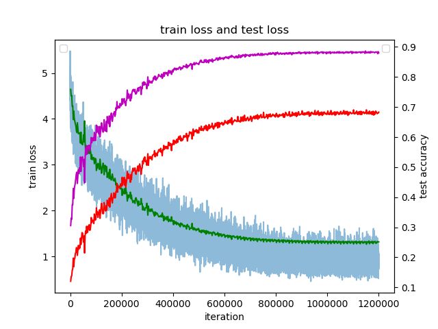

# resnet-caffe
Resnet18 trained from scrach on ImageNet.

the original KaimingHe implement：https://github.com/KaimingHe/deep-residual-networks

Facebook AI Research (FAIR)：https://github.com/facebookarchive/fb.resnet.torch

#### Single-crop (224x224) validation error rate

| Network   | Top-1 error | Top-5 error |
| --------- | ----------- | ----------- |
| KaimingHe | /           | /           |
| FAIR      | 30.43       | 10.76       |
| our       | 30.8625     | 11.6625     |

the trained model can be access from: https://pan.baidu.com/s/1_dPXOZd9Fkvb_67yhaMHNw code: fc7m

## details

I own use random crop and mirror, and the Top-1 error is 0.4% less than FAIR's. Currently I am working with more data augmentation.

the training process is shown below

## Demo 

see demo_image.py